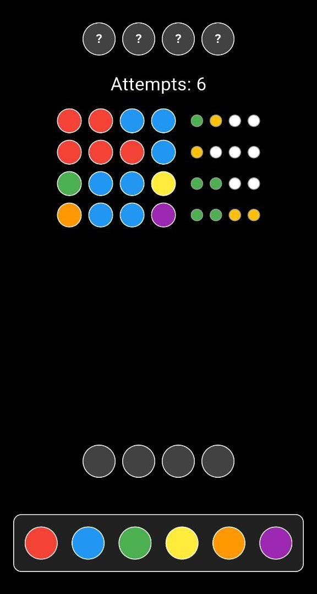

# SecretPattern 🎯

A Flutter implementation of the classic code-breaking game. Challenge your logic skills by deciphering the secret color pattern!

<br>

<p align="center">
  
</p>

## 📖 Game Rules

SecretPattern is a logic puzzle game where you must guess a secret sequence of 4 colored circles.

### Objective
Decode the secret pattern of 4 colors in 10 attempts or less.

### How to Play

1. **Secret Code**: At the start of each game, a secret sequence of 4 colors is randomly generated
2. **Available Colors**: Choose from 6 different colors: Red, Blue, Green, Yellow, Orange, and Purple
3. **Make Your Guess**: 
   - Tap on colors at the bottom to add them to your attempt
   - Or drag and drop colors into the empty circles
   - Tap on a filled circle to remove the color
4. **Submit**: Once all 4 circles are filled, tap the check button to submit your guess
5. **Feedback**: After each attempt, you'll receive hints:
   - 🟢 **Green circle**: Correct color in the correct position
   - 🟡 **Yellow circle**: Correct color but in the wrong position
   - ⚪ **White circle**: Color not in the secret code
6. **Win or Lose**: 
   - Win by guessing the exact pattern
   - Lose if you don't solve it within 10 attempts

## 🛠️ Built With

- **Flutter** - Cross-platform mobile framework
- **Dart** - Programming language

## 💻 Getting Started

### Prerequisites
- Flutter SDK (latest version)
- Dart SDK
- Android Studio / VS Code with Flutter extensions

### Installation

1. Clone the repository
```bash
git clone https://github.com/gabbor/secret-pattern.git
```

2. Navigate to the project directory
```bash
cd secret-pattern
```

3. Install dependencies
```bash
flutter pub get
```

4. Run the app
```bash
flutter run
```
